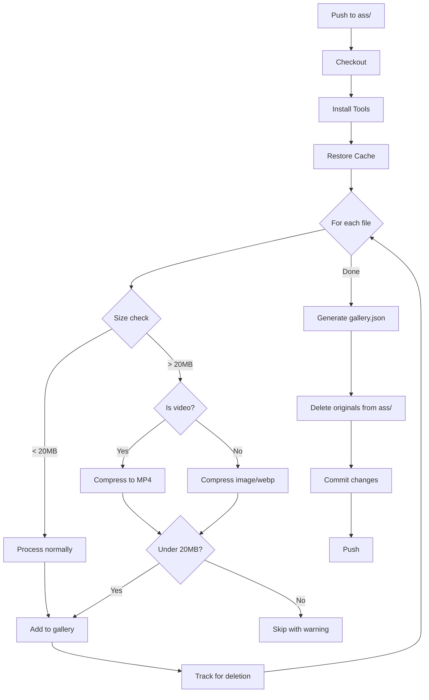

# Gallery Media Processing Design Document

## Executive Summary

This document outlines a solution for processing media files in a GitHub workflow for a Cloudflare Pages gallery with a 25MB file limit. The design addresses three key requirements: enforcing a 20MB hard limit, enabling chunked streaming for large videos, and deleting original files after processing.

---

## Current State Analysis

### Existing Workflow
- **Location**: [`.github/workflows/gallery.yml`](.github/workflows/gallery.yml)
- **Triggers**: Push to `main` with changes in `ass/` directory
- **Processing**:
  - Images → `thumbs/`, `blur/`, `webp/` directories
  - GIFs → `thumbs/`, `blur/`, original kept in `ass/`
  - Browser videos (mp4, webm, mov, ogg) → `thumbs/`, `blur/`, original in `ass/`
  - Non-browser videos (mkv, avi) → transcoded to `video/` as MP4
- **Output**: [`gallery.json`](gallery.json) with metadata

### Current File Sizes
| File | Size | Status |
|------|------|--------|
| `Maison_Ikkoku_Opening.mkv` | ~27MB | **EXCEEDS 20MB** |
| `Maison_Ikkoku_Ending.mkv` | ~11MB | Under 20MB |
| `671e548a-....png` | ~6.7MB | Under 20MB |
| `good morn cat.mp4` | ~3.2MB | Under 20MB |

### Key Observation
The workflow currently keeps original files in `ass/` for GIFs and browser-compatible videos, which violates the requirement to delete originals.

---

## Design Decisions

### 1. File Size Limit Strategy

**Recommendation: Compress with Fallback to Rejection**

```
┌─────────────────┐     ┌──────────────────┐     ┌─────────────────┐
│ File < 20MB     │────▶│ Process normally │────▶│ Keep processed  │
└─────────────────┘     └──────────────────┘     └─────────────────┘

┌─────────────────┐     ┌──────────────────┐     ┌─────────────────┐
│ File > 20MB     │────▶│ Attempt compress │────▶│ If < 20MB: keep │
└─────────────────┘     └──────────────────┘     └─────────────────┘
                               │
                               ▼
                        ┌──────────────────┐
                        │ If still > 20MB: │
                        │ Log warning,     │
                        │ skip from gallery│
                        └──────────────────┘
```

**Rationale**:
- Compression preserves content while meeting size constraints
- Rejection as fallback prevents deployment failures
- Warning logs allow manual intervention

**Implementation**:
```bash
# Two-pass compression for videos over 20MB
MAX_SIZE=$((20 * 1024 * 1024))  # 20MB in bytes

if [ "$size" -gt "$MAX_SIZE" ]; then
  # First pass: CRF 28
  ffmpeg -i "$f" -c:v libx264 -preset medium -crf 28 -c:a aac -b:a 96k -movflags +faststart "video/$base.mp4"
  
  # Check result
  new_size=$(stat -c%s "video/$base.mp4")
  if [ "$new_size" -gt "$MAX_SIZE" ]; then
    # Second pass: CRF 32 + scale down
    ffmpeg -i "$f" -c:v libx264 -preset medium -crf 32 -vf "scale=iw*0.75:ih*0.75" -c:a aac -b:a 64k -movflags +faststart "video/$base.mp4"
  fi
  
  # Final check
  final_size=$(stat -c%s "video/$base.mp4")
  if [ "$final_size" -gt "$MAX_SIZE" ]; then
    echo "::warning file=$f::Video exceeds 20MB even after compression. Skipping."
    rm "video/$base.mp4"
    continue
  fi
fi
```

---

### 2. Chunked Streaming Strategy

**Recommendation: Use HTTP Range Requests (Simpler Approach)**

Cloudflare Pages supports HTTP Range requests natively. This is the simplest approach that works without additional infrastructure.

**Why NOT HLS**:
| Factor | HLS | Range Requests |
|--------|-----|----------------|
| Complexity | High (segments, playlists, player) | Low (native browser support) |
| Files generated | Multiple .ts files + .m3u8 | Single .mp4 |
| Frontend changes | Requires hls.js library | None required |
| Storage overhead | ~20% more | None |
| Cloudflare support | Works but complex | Native support |

**How Range Requests Work**:
1. Browser sends `Range: bytes=0-` header
2. Cloudflare responds with `206 Partial Content`
3. Video streams progressively
4. User can seek to any position

**Frontend Requirement**: None! Standard `<video>` tags already support this:
```html
<video controls preload="metadata">
  <source src="video/example.mp4" type="video/mp4">
</video>
```

**For Very Large Videos (>50MB original)**: Consider optional HLS as a future enhancement, but with 20MB limit, this should not be needed.

---

### 3. Original File Deletion Strategy

**Recommendation: Delete After Successful Processing**

```
┌─────────────────────────────────────────────────────────────────────┐
│                     Processing Pipeline                              │
├─────────────────────────────────────────────────────────────────────┤
│                                                                      │
│  1. Scan ass/ directory                                              │
│  2. For each file:                                                   │
│     ├── Generate thumb/blur                                          │
│     ├── Process full-size (compress if needed)                       │
│     ├── Validate output exists                                       │
│     └── Track for deletion                                           │
│  3. Generate gallery.json                                            │
│  4. Delete processed originals from ass/                             │
│  5. Git add: thumbs/, blur/, webp/, video/, gallery.json             │
│  6. Git rm: ass/ (processed files only)                              │
│  7. Commit and push                                                  │
│                                                                      │
└─────────────────────────────────────────────────────────────────────┘
```

**Implementation**:
```bash
# Track processed files
processed_files=()

# After successful processing of each file:
processed_files+=("$f")

# After all processing complete:
for f in "${processed_files[@]}"; do
  rm "$f"
done

# Git operations
git add thumbs blur webp video gallery.json
git add -u ass/  # Stage deletions
git diff --staged --quiet && echo "No changes to commit" || {
  git commit -m "update gallery (processed $((${#processed_files[@]})) files)"
  git push
}
```

---

## Implementation Outline

### Workflow Changes



### Key Workflow Modifications

1. **Add size validation step**:
   ```yaml
   - name: Check file sizes
     run: |
       MAX_SIZE=$((20 * 1024 * 1024))
       find ass/ -type f -size +${MAX_SIZE}c > large_files.txt || true
       if [ -s large_files.txt ]; then
         echo "Files exceeding 20MB (will be compressed):"
         cat large_files.txt
       fi
   ```

2. **Update processing logic** for all file types to output to processed directories only

3. **Add deletion step**:
   ```yaml
   - name: Cleanup originals
     run: |
       # Remove all processed files from ass/
       find ass/ -type f -delete
       # Remove empty directories
       find ass/ -type d -empty -delete 2>/dev/null || true
   ```

4. **Update commit step** to include deletions:
   ```yaml
   - name: Commit
     run: |
       git config user.name "gallery-bot"
       git config user.email "bot@example.com"
       git add thumbs blur webp video gallery.json
       git add -u ass/  # Stage deletions
       git diff --staged --quiet && echo "No changes to commit" || {
         git commit -m "update gallery"
         git push
       }
   ```

### Frontend Changes

**Minimal changes required** - the current [`index.html`](index.html) already works with the new structure:

1. **Update video source paths** - videos now come from `video/` instead of `ass/`
2. **Update GIF handling** - consider converting large GIFs to video for better performance

**Optional Enhancement** - Add lazy loading for videos:
```javascript
// Use IntersectionObserver for video lazy loading
const videoObserver = new IntersectionObserver((entries) => {
  entries.forEach(entry => {
    if (entry.isIntersecting) {
      const video = entry.target;
      video.src = video.dataset.src;
      videoObserver.unobserve(video);
    }
  });
}, { rootMargin: '100px' });

document.querySelectorAll('video[data-src]').forEach(v => videoObserver.observe(v));
```

---

## Tradeoffs and Considerations

### Compression Quality vs Size

| CRF Value | Quality | Size Reduction | Use Case |
|-----------|---------|----------------|----------|
| 23 | High | ~30% | Default, under 20MB |
| 28 | Medium | ~50% | First pass compression |
| 32 | Low | ~70% | Second pass, aggressive |

### GIF Handling Options

**Option A: Keep as GIF** (Current)
- Pros: Animated thumbnails work
- Cons: Large file sizes, no compression

**Option B: Convert to MP4** (Recommended)
- Pros: 80-90% size reduction, better streaming
- Cons: Requires video element instead of img

```bash
# Convert GIF to MP4
ffmpeg -i "ass/$name" -c:v libx264 -preset fast -crf 23 -pix_fmt yuv420p -movflags +faststart "video/$base.mp4"
```

### Edge Cases

1. **File fails processing**: Log error, skip from gallery, keep original for manual review
2. **Empty ass/ directory**: Generate empty gallery.json, no error
3. **Concurrent pushes**: Already handled by `concurrency` group

---

## Summary of Changes

### Files to Modify

| File | Changes |
|------|---------|
| `.github/workflows/gallery.yml` | Add size checks, compression logic, deletion step |
| `index.html` | Update video paths, optional lazy loading |
| `gallery.json` | Schema unchanged, paths updated |

### New Behavior

| File Type | Before | After |
|-----------|--------|-------|
| Images | Original in `ass/`, processed in `webp/` | Only in `webp/` |
| GIFs | Original in `ass/` | Converted to MP4 in `video/` |
| Videos | Original in `ass/` or transcoded to `video/` | Only in `video/` |
| Large files | No limit | Compressed or rejected at 20MB |

---

## Testing Recommendations

1. **Test with current large file** (`Maison_Ikkoku_Opening.mkv` at 27MB)
2. **Verify compression output** stays under 20MB
3. **Test frontend playback** with range requests
4. **Verify git operations** correctly delete from `ass/`

---

## Future Enhancements

1. **HLS for very long videos** (>10 minutes) - if needed
2. **WebP animations** as GIF replacement
3. **AVIF support** for better image compression
4. **Responsive video** with multiple quality options
